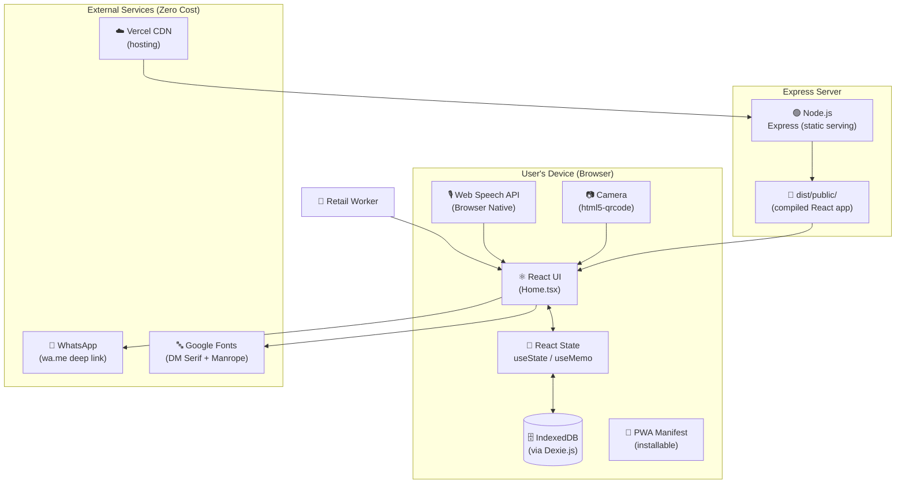
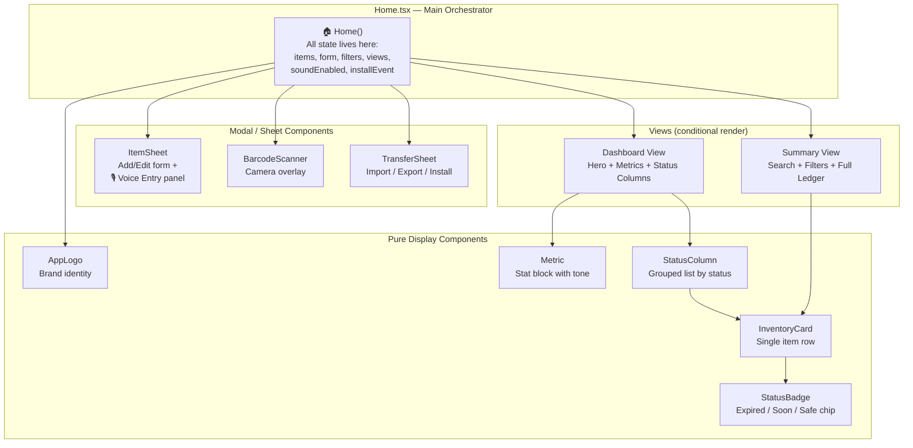
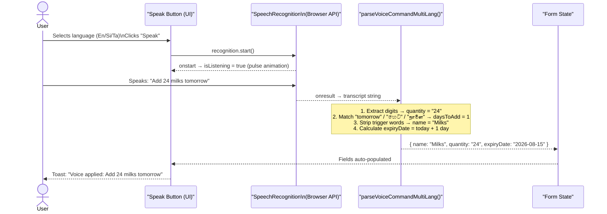
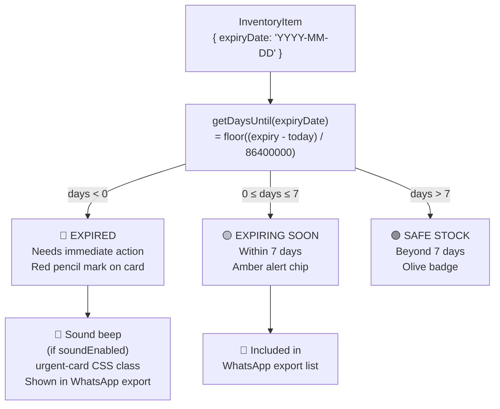
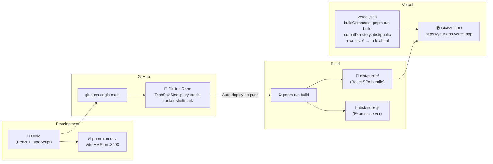
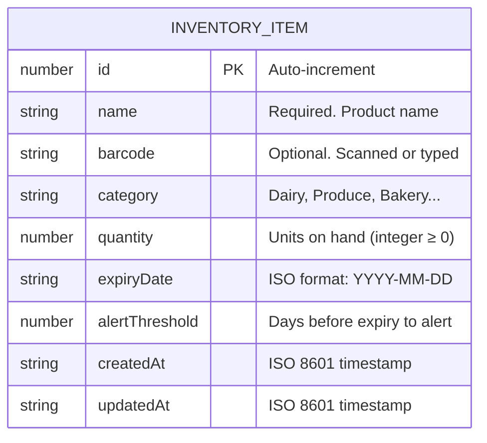

# Shelfmark — System Architecture

> A visual breakdown of how Shelfmark is designed, how data flows through the system, and how the key features are wired together.

---

## 1. High-Level Architecture Overview

Shelfmark is an **offline-first Single-Page Application (SPA)**. There is no traditional backend database. All user data lives on the device inside the browser's `IndexedDB`. The Express server exists solely to serve the compiled static files.

---

## 2. Data Flow Architecture

This diagram shows the complete lifecycle of data — from user input to storage and back to the screen.

```mermaid
flowchart LR
    subgraph INPUT["Data Entry Methods"]
        MANUAL["⌨️ Manual Form\nTyped input"]
        VOICE["🎙️ Voice Command\nEn / Si / Ta"]
        SCAN["📷 Barcode Scan\nCamera"]
        IMPORT["📂 JSON/CSV Import\nFile upload"]
    end

    subgraph PROCESS["Processing Layer (React)"]
        PARSE["🔍 parseVoiceCommand()\nNLP extraction"]
        VALIDATE["✅ Form Validation\nname, date, qty > 0"]
        NORMALIZE["🔧 normalizeImportedItem()\nData sanitization"]
    end

    subgraph STORAGE["Storage Layer"]
        DEXIE["📦 Dexie.js ORM"]
        IDB[("🗄️ IndexedDB\nshelfmark-inventory")]
        SCHEMA["📋 Schema v2\n++id, name, barcode,\ncategory, expiryDate,\nalertThreshold, updatedAt"]
    end

    subgraph OUTPUT["Output / Display"]
        FILTER["🔍 Filter & Search\nuseMemo derived state"]
        CARDS["📇 Inventory Cards\nExpired / Soon / Safe"]
        EXPORT_W["💬 WhatsApp\nExpiry list message"]
        EXPORT_F["📁 JSON / CSV\nDownload backup"]
    end

    MANUAL --> VALIDATE
    VOICE --> PARSE --> VALIDATE
    SCAN --> VALIDATE
    IMPORT --> NORMALIZE --> DEXIE

    VALIDATE --> DEXIE
    DEXIE <--> IDB
    IDB -.->|"schema defined"| SCHEMA
    IDB -->|"orderBy expiryDate"| FILTER
    FILTER --> CARDS
    FILTER --> EXPORT_W
    FILTER --> EXPORT_F
```

---

## 3. Component Architecture

The entire UI is contained within a single file (`Home.tsx`) using a **composition** pattern with clearly separated sub-components.

---

## 4. Voice Command System

The voice feature uses a pipeline from raw audio → text → structured data.

---

## 5. Status Classification Engine

Every item is classified in real-time using a pure function — no background jobs needed.

---

## 6. Deployment Pipeline

---

## 7. IndexedDB Schema

**Indexes defined:** `id` (PK), `name`, `barcode`, `category`, `expiryDate`, `updatedAt`

---

## 8. Technology Decisions

| Decision | Choice | Reason |
|---|---|---|
| **Storage** | IndexedDB (Dexie.js) | Offline-first, no server costs, data stays on device |
| **Voice** | Web Speech API | Free, browser-native, no API keys needed |
| **Barcode** | html5-qrcode | Camera-based, works on any HTTPS page |
| **Routing** | Wouter | Tiny alternative to React Router (1.3kb) |
| **Styling** | Tailwind CSS v4 + Custom CSS | Utility-first speed + bespoke "Paper Ledger" tokens |
| **State** | React useState/useMemo | No Redux needed — all state is local and derived |
| **Notifications** | Sonner | Elegant toast library with minimal footprint |
| **Hosting** | Vercel | Zero-config deployment, global CDN, free tier |
